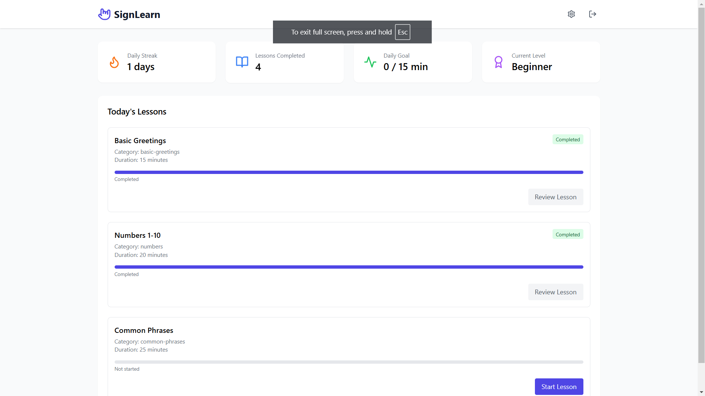
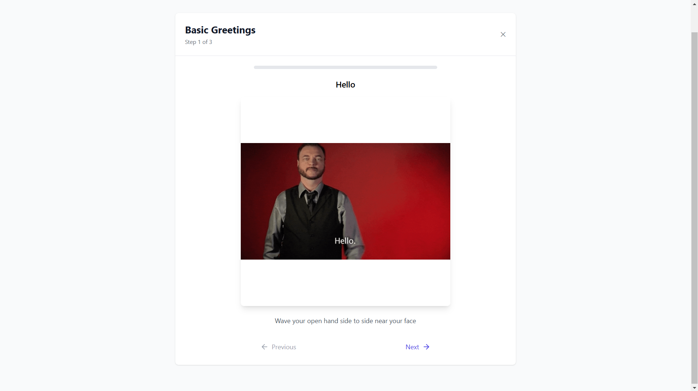
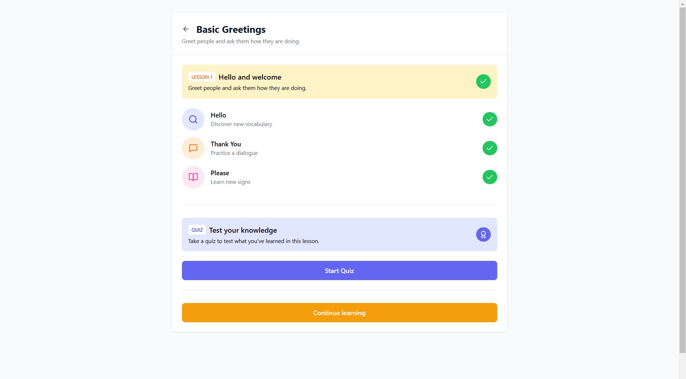
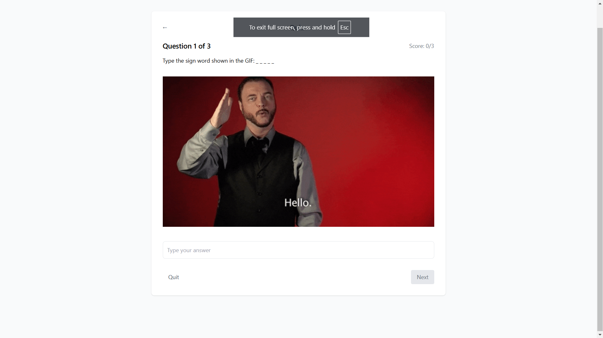
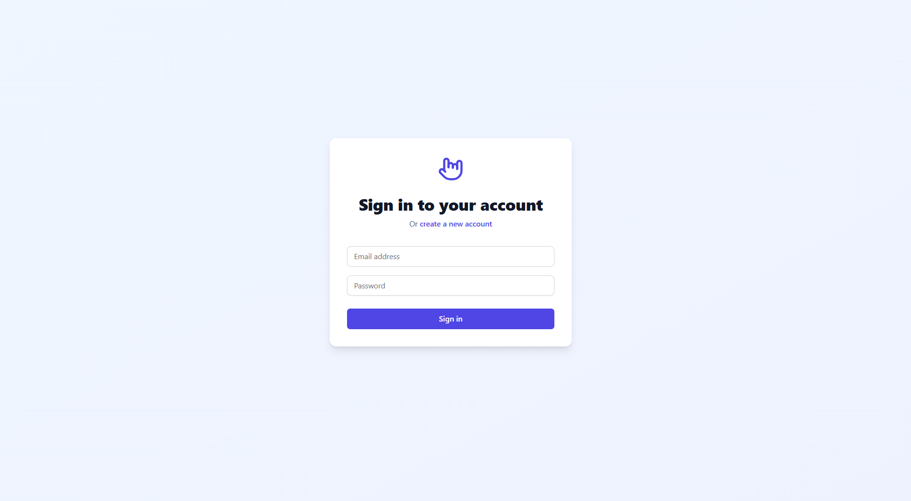
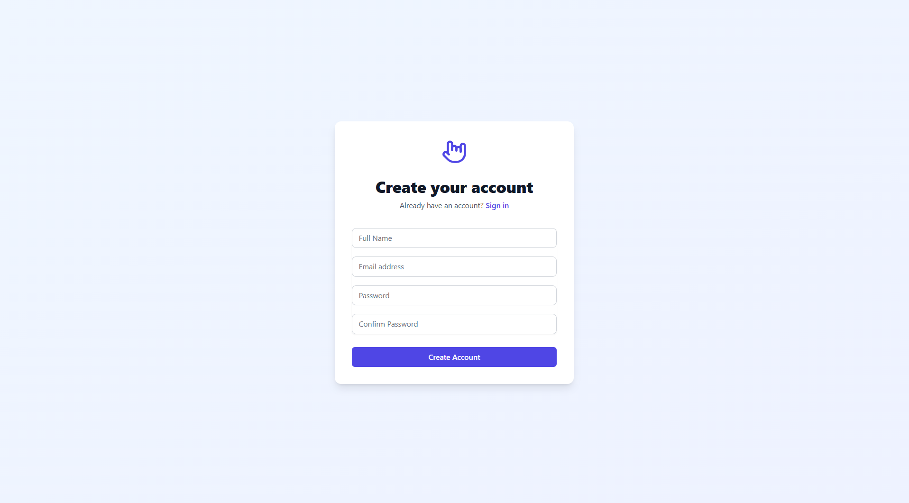
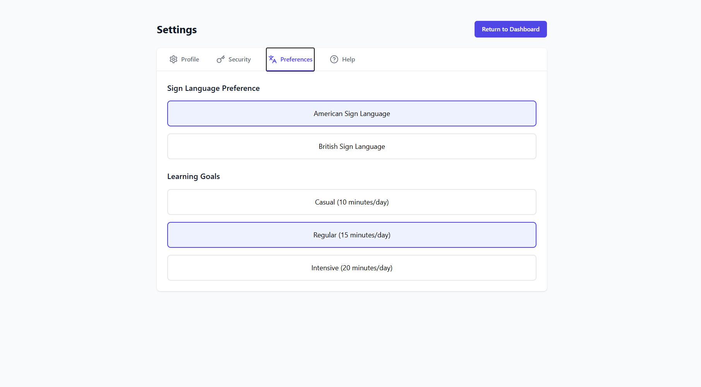

# Sign Language Learning Application

A modern web application built with React and TypeScript to help users learn sign language through interactive lessons and practice sessions. This platform provides an intuitive and engaging way to master sign language at your own pace.

## Features

- Interactive sign language lessons with video demonstrations
- Real-time practice sessions with feedback
- Comprehensive user progress tracking and analytics
- Responsive design optimized for desktop, tablet, and mobile devices
- Secure user authentication system
- Personalized learning dashboard with progress insights
- Customizable learning paths
- Achievement system to keep users motivated
- Community features for peer learning

## Screenshots

### Dashboard


### Lessons


### Chapters


### Quiz


### Login


### Register


### Settings


## Tech Stack

- React 18
- TypeScript
- Vite
- TailwindCSS
- React Router DOM

## Prerequisites

- Node.js (v16 or higher)
- npm or yarn

## Installation

1. Clone the repository
```bash
git clone https://github.com/adarshsharma-18/SIGNLEARN-sign_learning_platform
cd sign-language-learning
```

2. Install dependencies
```bash
npm install
```

3. Start the development server
```bash
npm run dev
```

## Available Scripts

- `npm run dev` - Starts the development server
- `npm run build` - Builds the app for production
- `npm run preview` - Previews the production build locally
- `npm run lint` - Runs ESLint for code quality

## Project Structure

```
src/
├── assets/        # Static assets and images
│   ├── gifs/      # GIF animations
│   └── images/    # Static images and icons
├── components/    # React components
│   ├── auth/      # Authentication related components
│   ├── dashboard/ # Dashboard components
│   ├── lesson/    # Lesson related components
│   ├── quiz/      # Quiz components
│   ├── common/    # Shared/reusable components
│   └── settings/  # User settings components
├── contexts/      # React context providers
├── hooks/         # Custom React hooks
├── pages/         # Page components
├── services/      # API and external service integrations
├── styles/        # Global styles and CSS modules
├── types/         # TypeScript type definitions
├── utils/         # Utility functions
└── App.tsx        # Main application component
```

## Getting Started

Follow these steps to get the application running on your local machine:

1. Ensure you have all prerequisites installed
2. Clone the repository and install dependencies
3. Configure environment variables (copy `.env.example` to `.env`)
4. Start the development server
5. Access the application at `http://localhost:5173`

## Usage

1. Create an account or log in
2. Complete the onboarding process
3. Choose your learning path
4. Start with basic lessons
5. Practice regularly and track your progress
6. Take quizzes to test your knowledge
7. Earn achievements as you progress


## Contributing

1. Fork the repository
2. Create your feature branch (`git checkout -b feature/AmazingFeature`)
3. Commit your changes (`git commit -m 'Add some AmazingFeature'`)
4. Push to the branch (`git push origin feature/AmazingFeature`)
5. Open a Pull Request

## License

This project is licensed under the MIT License - see the LICENSE file for details.